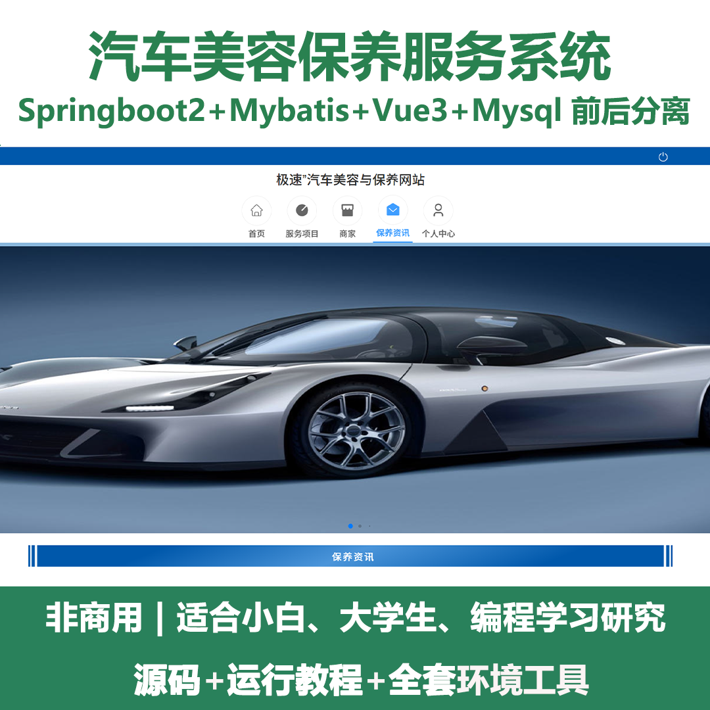
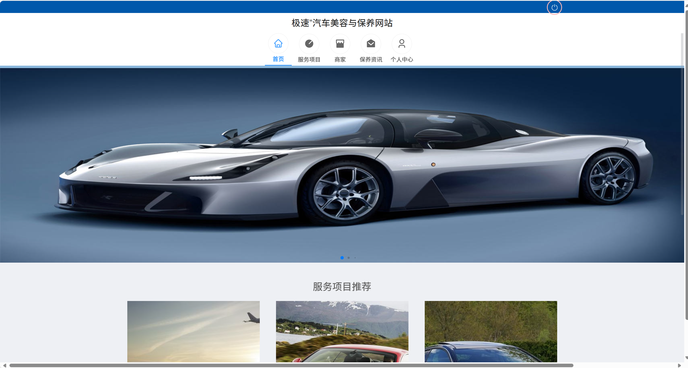
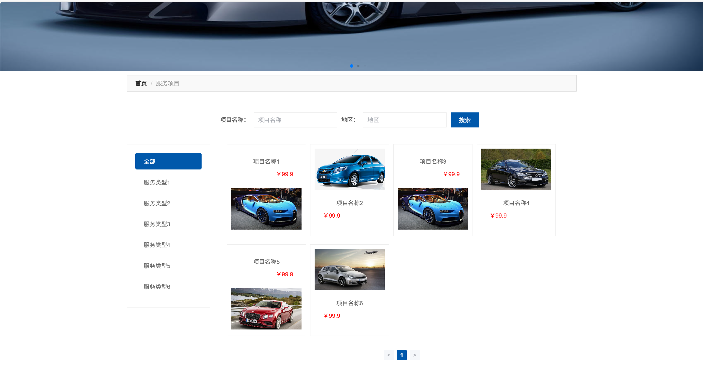
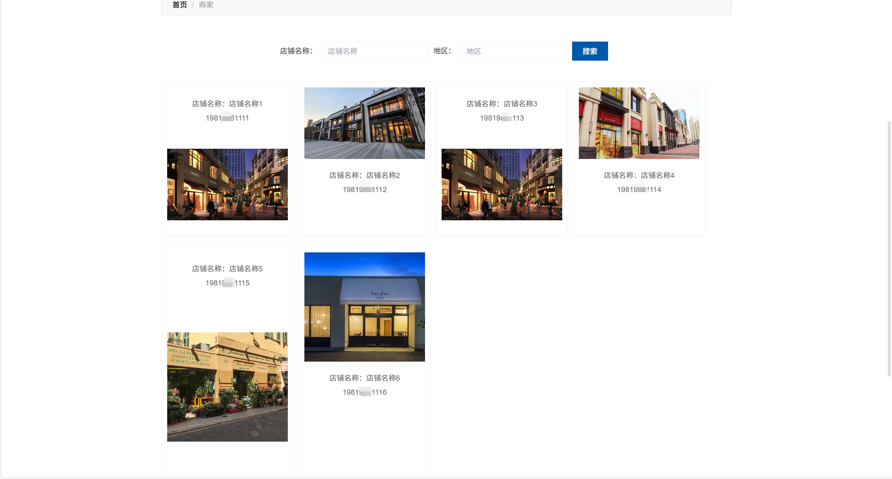
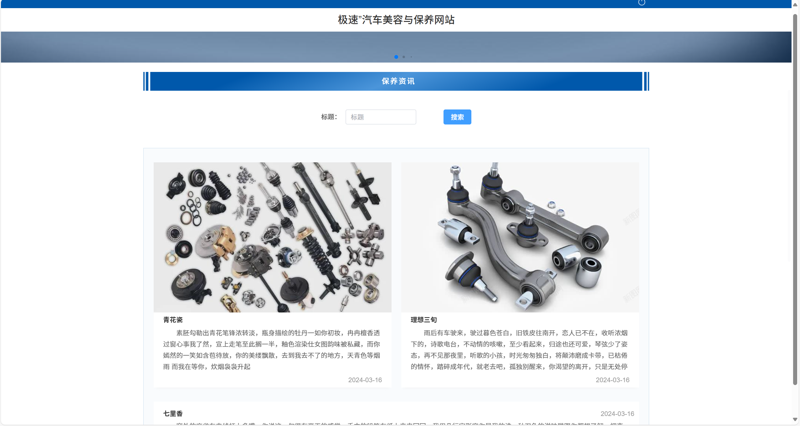
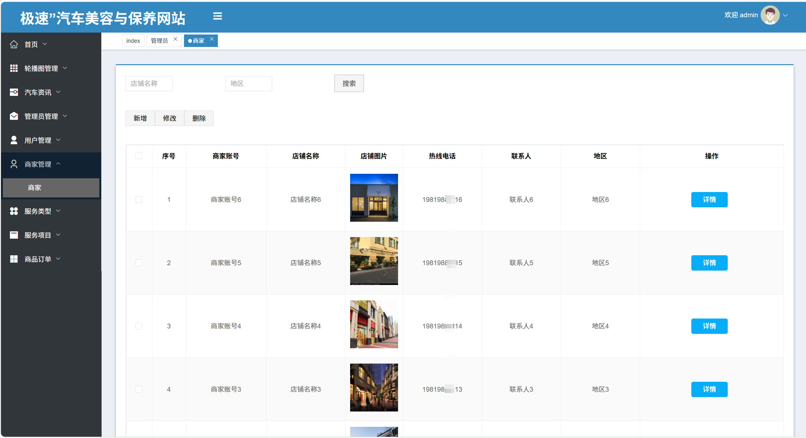
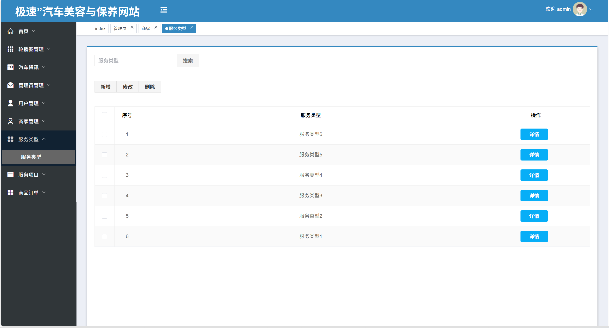
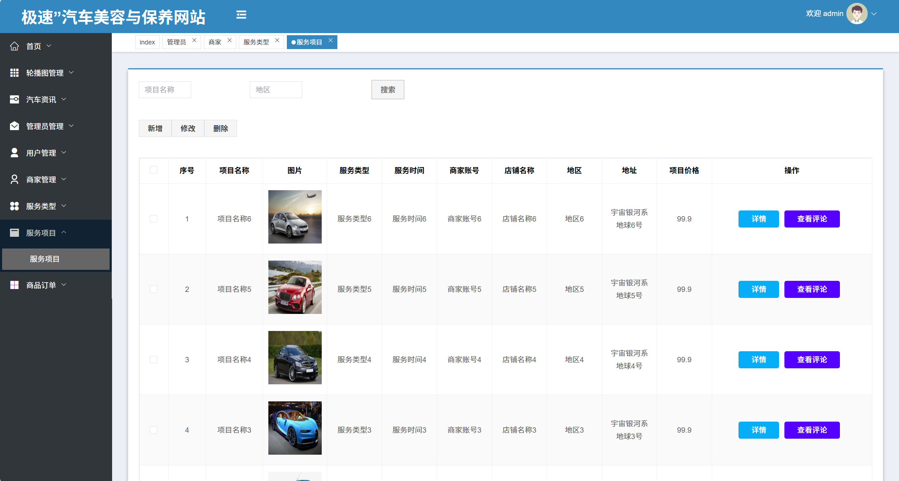
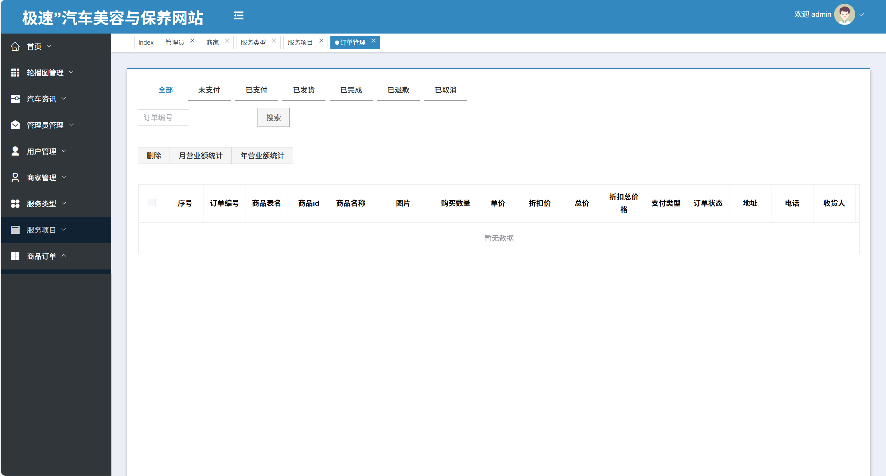

# springbootA548
springbootA548汽车美容保养服务系统（Vue3）
 
## 源码问题查看主页咨询

### 一、关键词
汽车美容保养服务系统，汽车美容养护服务平台，车辆美容保养管理系统

### 二、作品包含
源码+数据库+全套环境和工具资源+本地部署教程

### 三、项目技术
前端技术：Html、Css、Js、Vue3.0、Element-plus
后端技术：Java、SpringBoot2.0、MyBatis

### 四、运行环境（以下版本亲测，其他版本兼容性请自行测试）
开发工具：IDEA/eclipse  + VSCODE

数据库：MySQL8

数据库管理工具：Navicat10以上版本

环境配置软件： JDK17 + Maven3.6.3

前端Nodejs：20

浏览器：谷歌浏览器

### 五、项目介绍
项目编号：springbootA548

采用M（model）V（view）C（controller）三层体系结构，MySQL数据库作为系统数据储存平台，实现了基于B/S结构的Web系统。

系统功能模块：
本系统包含管理员、用户、商家3个角色。
1.管理员角色：
轮播图管理：管理轮播图的配置参数。
汽车资讯管理：管理保养资讯的发布与维护。
用户管理：管理系统中所有用户的信息，包括添加、删除和修改用户。
商家管理：管理商家的信息，包括添加、删除和修改商家。
服务类型管理：管理服务类型的添加、删除和修改。
服务项目管理：管理服务项目的添加、删除和修改。
订单管理：管理商品订单的状态，包括查看、删除、统计营业额等。
2.用户角色：
保养预约：用户可以预约保养服务，填写预约信息并上传相关图片。
购物车管理：用户可以管理购物车中的商品，包括添加、删除和修改商品。
提醒与通知管理：用户可以查看商家发送的提醒与通知。
订单管理：用户可以查看自己的订单状态，包括未支付、已支付、已完成、已取消、已退款、已发货等。
我的收藏管理：用户可以管理自己的收藏，包括添加、删除和修改收藏。
3.商家角色：
汽车资讯管理：商家可以发布和维护保养资讯。
服务类型管理：商家可以管理服务类型的添加、删除和修改。
服务项目管理：商家可以管理服务项目的添加、删除和修改。
保养预约管理：商家可以查看和处理用户的保养预约。
提醒与通知管理：商家可以发送提醒与通知给用户。
订单管理：商家可以管理商品订单的状态，包括查看、删除、统计营业额等。

### 六、运行截图

 
